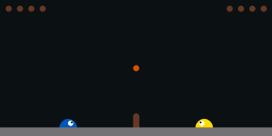
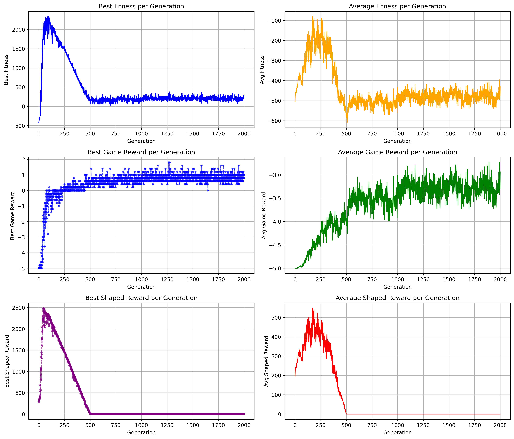
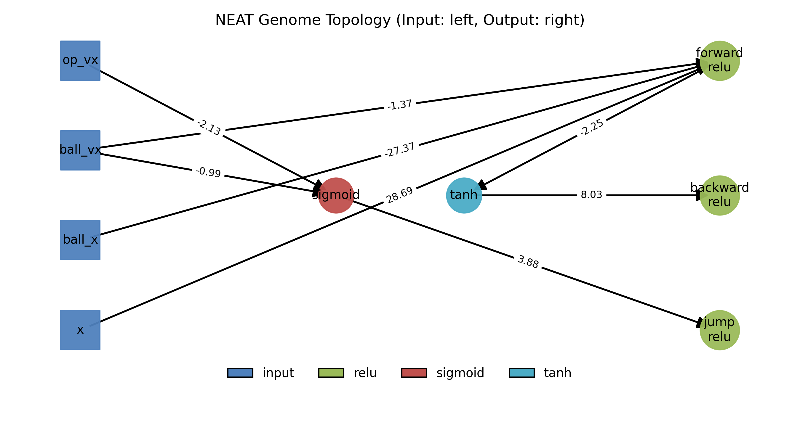

# NEAT SlimeVolley

Feed-forward NEAT implementation that successfully learns to play Slime Volley using curriculum learning. The agent progresses through two phases:

1. Initial training with shaped rewards based on ball proximity to develop basic ball-tracking skills
2. Advanced training with random ball starts and pure score-based rewards to master competitive gameplay

The agent learns to play using only a feed-forward neural network (no recurrence needed). The drop in fitness around generation 200 shows the curriculum shift to harder scenarios, after which the agent adapts to become a robust player.
We use parallel training with 8 workers to speed up the process so that training is completed in about 2 hours.



## Training Progress



## Final Network Topology



## Game Performance Stats

Results from running the trained agent against the built-in opponent over 1000 games:

### Match Statistics

- Wins: 299 (29.90%)
- Draws: 545
- Losses: 156

### Point Statistics

- Points Won: 464 (64.44%)
- Points Lost: 256

The agent shows strong performance in scoring points (64.44% success rate) while maintaining a positive win-draw-loss record. The high number of draws indicates extended rallies, suggesting good defensive capabilities.

## Quick Start

1. Create and activate a virtual environment:

```bash
python -m venv venv
source venv/bin/activate  # On Windows: venv\Scripts\activate
```

2. Install requirements:

```bash
pip install -r requirements.txt
```

3. Train NEAT:

```bash
python train.py
```

Training will save:

- Best genomes in `models/`
- Training logs in `logs/`
- Progress can be visualized with `python plot_logs.py`

4. Visualize a trained agent:

```bash
python visualize.py --model models/slime_1038.pkl
```

## Implementation Details

- Feed-forward only NEAT implementation (no recurrent connections)
- Input: 12 values (position/velocity of agent, ball, and opponent)
- Output: 3 actions (forward, backward, jump)
- Fitness: Shaped reward focusing on ball proximity early in training, transitioning to pure score-based fitness
- Population size: 150
- Training takes about 1000-2000 generations to find a robust solution
